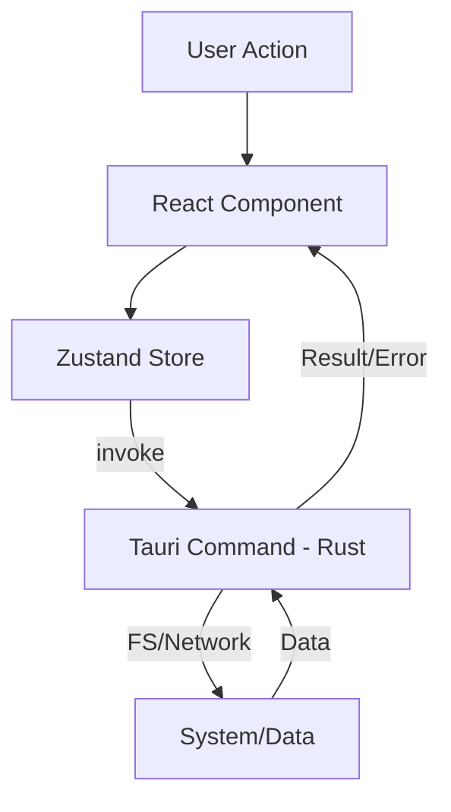

# Architecture Overview

Genzo-Kit follows a modern hybrid desktop architecture using Tauri for system integration and React for the user interface.

## 3.1 High-Level Architecture
- **Backend (Rust):** Handles CPU-intensive tasks (regex scanning, filesystem traversal) and safe File I/O.
- **Frontend (React + TS):** Handles UI state, user interactions, and editor rendering.
- **IPC:** Communication via Tauri's `invoke` (Request/Response). No background polling used.

## 3.2 Frontend Architecture
- **`src/App.tsx`**: Main container for sidebar and tool routing. Handles global shortcuts (Ctrl+Shift+S) and local window-level listeners for tool switching (Ctrl+Alt+C/N).
- **State Management**: Uses **Zustand** for lightweight, reactive state. Most stores are persisted to `localStorage` or synced with the backend.
- **Styling**: Tailwind CSS + Shadcn UI for a professional, dark IDE-like aesthetic.

## 3.3 Backend (Tauri / Rust)
- **`src-tauri/src/lib.rs`**: Single entry point for all system-level logic.
- **Domain Modules (Logical groups):**
    - **File IO**: `read_file_encoded`, `save_file_encoded`.
    - **Note Session**: `save_note_session`, `load_note_session`.
    - **System Scan**: `search_system`, `search_files`, `open_path`.
    - **Parallel Search Engine**: `src-tauri/src/search.rs` (Rayon/Ignore/Fuzzy-Matcher).
    - **Property Scanning**: `scan_files`, `replace_in_files`.

## 3.4 Data Flow Diagram

## 3.5 Key Dependencies

### Frontend (`package.json`)
- **`@monaco-editor/react`**: Powers the Text Comparator and Note Editor.
- **`zustand`**: Global and tool-specific state management.
- **`lucide-react`**: Consistent iconography.
- **`sql-formatter`**: Used in the Log SQL Extractor.
- **`tailwindcss`**: Utility-first styling.

### Backend (`Cargo.toml`)
- **`tauri`**: Core framework for desktop integration.
- **`regex`**: High-speed text pattern matching.
- **`ignore / rayon`**: Parallel, multi-threaded filesystem traversal.
- **`fuzzy-matcher`**: Ranked results (Skim V2).
- **`encoding_rs`**: Robust encoding/decoding for legacy files (Shift_JIS, etc.).
- **`reqwest`**: HTTP client for URL content fetching.
